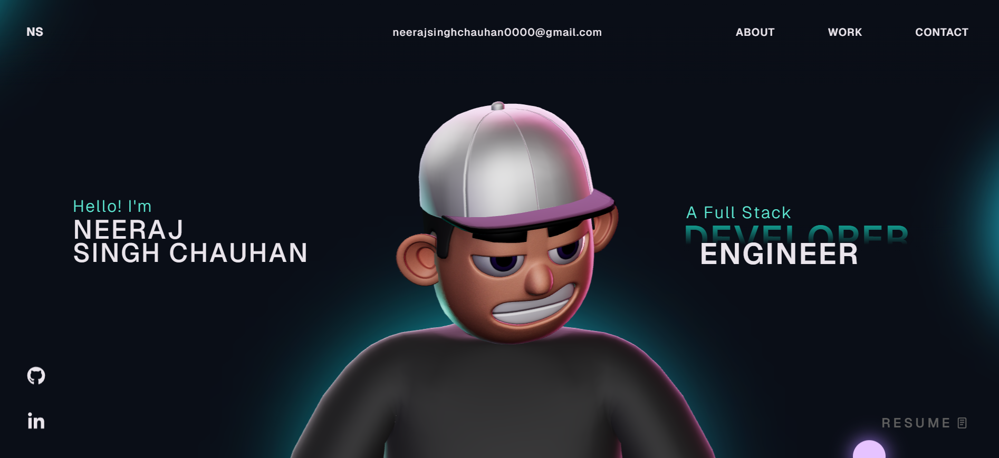

# 🚀 Neeraj's 3D Interactive Portfolio

A modern, high-performance developer portfolio built with React, Three.js, and GSAP. This project showcases my skills in frontend development, 3D web graphics, and interactive web animations.



## ✨ Key Features

- **3D Graphics & Models:** Built with Three.js and React Three Fiber to render immersive 3D elements directly in the browser.
- **Advanced Animations:** Smooth, high-performance scroll animations and transitions powered by GSAP.
- **Responsive Design:** Fully responsive layout that adapting beautifully across desktop, tablet, and mobile devices.
- **Modern Build:** Powered by Vite for lightning-fast hot module replacement (HMR) and optimized production builds.
- **TypeScript:** Fully typed codebase for reliability and maintainability.

## 🛠️ Tech Stack

- **Framework:** React 18
- **Language:** TypeScript / JavaScript
- **3D Rendering:** Three.js, webGL, @react-three/fiber, @react-three/drei
- **Animations:** GSAP (GreenSock Animation Platform)
- **Styling:** CSS3, HTML5
- **Bundler:** Vite

## ⚠️ Important Note regarding GSAP

This open-source version of the portfolio uses **GSAP Trial Plugins** for demonstration purposes. 
*Please note:* Trial plugins are restricted and **cannot be hosted** on a live production domain. If you wish to deploy this or use the premium features (like ScrollSmoother or MorphSVG) in production, you will need an official Club GSAP membership.

🔗 [Check out GSAP Installation Docs](https://gsap.com/docs/v3/Installation/)

## 🚀 Getting Started

Follow these instructions to run the project locally on your machine.

### Prerequisites
Make sure you have Node.js and npm (Node Package Manager) installed on your system.

### Installation

1. **Clone the repository:**
   ```bash
   git clone https://github.com/your-username/Neeraj-Portfolio.git
.
